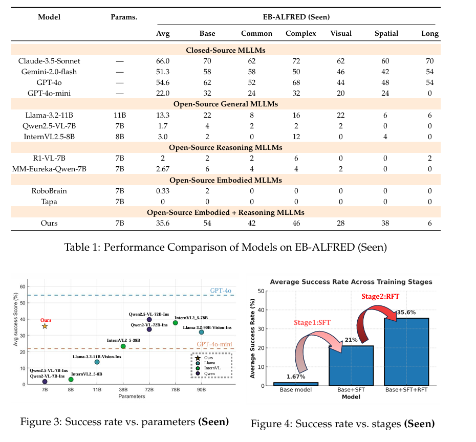
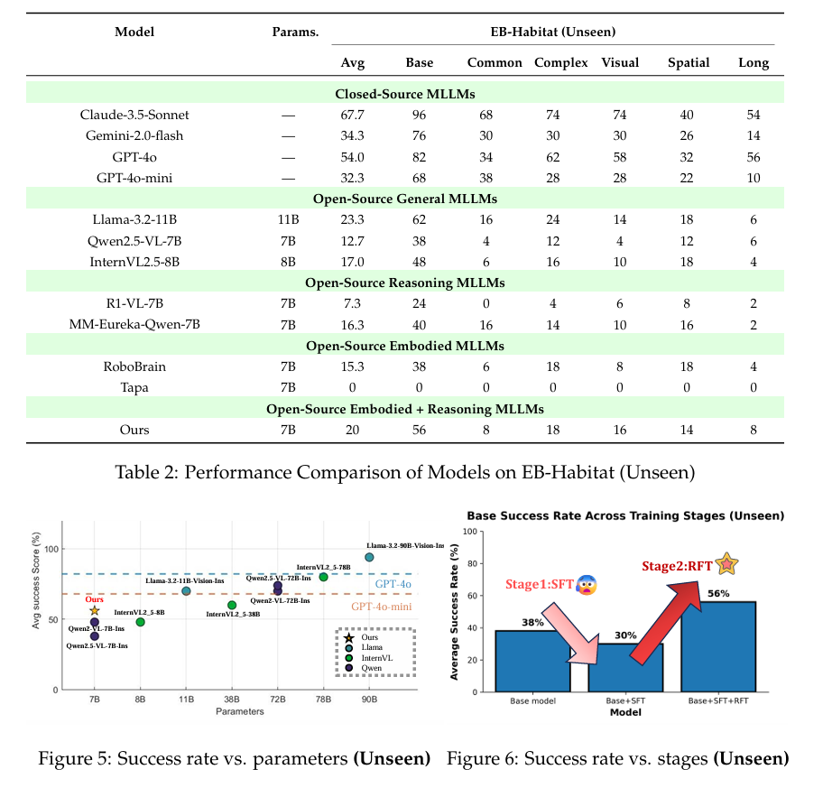

# 🤖🗺️ Reinforced Reasoning for Embodied Planning <!-- README Title -->

<!-- <p align="center">
  
</p> -->

<!-- Badges -->
<p align="center">
  <a href="https://arxiv.org/abs/2505.22050">
    
  </a>
  <a href="https://huggingface.co/poopoo3882/Reinforced_Reasoning_for_Embodied_Planning">
    
  </a>
  <!-- <a href="https://your-project-site.org">
    
  </a> -->
</p>

> **Reinforced Reasoning for Embodied Planning**  
<!-- > Under Review, Anonymous Authors -->

> [Di Wu](https://wudi7012.github.io/), [Jiaxin Fan*](https://github.com/mail-taii/Reinforced-Reasoning-for-Embodied-Planning), [Junzhe Zang*](https://github.com/mail-taii/Reinforced-Reasoning-for-Embodied-Planning), [Guanbo Wang](https://github.com/mail-taii/Reinforced-Reasoning-for-Embodied-Planning), [Wei Yin](https://github.com/mail-taii/Reinforced-Reasoning-for-Embodied-Planning), [Wenhao Li†](https://ewanlee.weebly.com/), [Bo Jin†](https://cs.tongji.edu.cn/info/1063/2768.htm)

>Tongji MAIL-TAII Lab, Tongji University, Tsinghua University, Bank of Communications


<p align="center">
  
</p>

<!-- ---

## 🔗 Jump to
| Section | Description |
|---------|-------------|
| [Overview](#-overview) | What is *Reinforced Reasoning for Embodied Planning*? |
| [Model](#-model) | Architecture & weights |
| [Usage](#️-usage) | Quick-start & inference |
| [Performance](#-performance) | Numbers on Embench |
| [Changelog](#-changelog) | Release history |
| [Acknowledgement](#-acknowledgement) | Credits |
| [Citation](#-citation) | How to cite |

--- -->
---

## 🧐 Overview

**Multi-step embodied planning** tasks challenge agents to translate first-person visual observations and natural-language goals into coherent, sequential actions that dynamically affect their environment. Unlike static tasks like visual QA or math, these tasks require continuous spatial reasoning, temporal consistency, and adaptation across multiple decision turns.

However, current vision-language models (VLMs), even those with strong static capabilities, often fail in such settings—producing redundant, incoherent, or short-sighted action sequences.

To address this gap, we propose:

> 🔁 **Reinforced Reasoning for Embodied Planning**
> A two-stage fine-tuning pipeline that equips VLMs with **multi-step reasoning** and **long-horizon planning** abilities in dynamic environments.

### 🔧 Our Pipeline

1. **Supervised Fine-tuning (SFT):**
   We distill \~4k high-quality multi-step trajectories from a powerful teacher model into Qwen2.5-VL-7B to initialize commonsense and structured reasoning.

2. **Reinforcement Fine-tuning (RFT):**
   Using a **rule-based reward** tailored for multi-step decision quality, we apply **GRPO** to align model outputs with long-horizon planning objectives.

### 🧪 Results

We evaluate on the **Embench** benchmark (EB-ALFRED & EB-Habitat) and find that our 7B model:

* Outperforms 70B+ open-source baselines,
* **Surpasses GPT-4o-mini** in planning efficiency and coherence,
* Generalizes well to unseen embodied environments.


## 🗒️ News

* **2025-08-16** : 📦 Update relevant data and **RFT** model
* **2025-05-28** : 🚀 We released our initial [arXiv paper](https://arxiv.org/abs/2505.22050) on **Reinforced Reasoning for Embodied Planning**.
* **2025-06-06** : 🧠 Github Page Released.
* **2025-06-17** : 🛠️ Published the github page and related data.
<!-- * **2025-06-06** : 📦 We released our [training datasets](https://huggingface.co/your-org/rr-ep-sft-data) for both SFT and RFT stages.
* **2025-06-07** : 🛠️ We open-sourced all [code and scripts](https://github.com/your-org/rr-ep) for fine-tuning, evaluation, and inference. -->

---


## 🏗️ Model and Dataset

We release all key components of our two-stage training pipeline, including datasets and models for both **Supervised Fine-tuning (SFT)** and **Reinforcement Fine-tuning (RFT)**.

| Component          | Description                                             | Download                                                           |
| ------------------ | ------------------------------------------------------- | ------------------------------------------------------------------ |
| 🧩 **SFT Dataset** | \~4.2k Gemini-2.0 distilled multi-step plans            | [🤗 Hugging Face](https://huggingface.co/datasets/poopoo3882/Reinforced_Reasoning_for_Embodied_Planning/tree/main/SFT_training_data)  |
| 🧩 **RFT Dataset** | \~43.9k ALFRED-derived episodes with reward annotations | [🤗 Hugging Face](https://huggingface.co/datasets/poopoo3882/Reinforced_Reasoning_for_Embodied_Planning/tree/main/RFT_training_data)  |
| 🧠 **SFT Model**   | Qwen2.5-VL-7B fine-tuned with SFT only                  | [🤗 Hugging Face](https://huggingface.co/poopoo3882/Reinforced_Reasoning_for_Embodied_Planning) |
| 🧠 **RFT Model**   | Qwen2.5-VL-7B further optimized via GRPO                | [🤗 Hugging Face](https://huggingface.co/poopoo3882/Reinforced_Reasoning_for_Embodied_Planning)


---
## ⚡️ Simple Usage

<details open>
<summary><strong>STAGE 1. 🧠 Supervised Fine-tuning (SFT)</strong></summary>

**Step 1. Environment Setup**

You can directly follow the instructions in [Llama_factory](https://github.com/hiyouga/LLaMA-Factory) to complete the SFT stage and find more detailed guidance.
```bash
# You can setup conda...
cd SFT_training
pip install -e ".[torch,metrics]"

```

**Step 2. Prepare Dataset**

Download our SFT Dataset, 
follow instructions in [llama_factory_Data_Readme.md](SFT%20training/data/README.md)
 to prepare the dataset (What you mainly need to do is adding our dataset to dataset_info.json)

**Step 3. Launch Training**

You need config the yaml file before launching
```bash
# Lora
llamafactory-cli train examples/train_lora/qwen2vl_lora_sft.yaml

# merge Lora after training
llamafactory-cli export examples/merge_lora/qwen2vl_lora_sft.yaml

# Full Parameters
llamafactory-cli train examples/train_full/qwen2vl_full_sft.yaml

```
After training, you will get the SFT model for the next RL stage.

</details>

<details>
<summary><strong>STAGE 2. 🎯 Reinforcement Fine-tuning (RFT)</strong></summary>

**Step 1. Environment Setup**

```bash
# You can setup conda...
cd RFT training
pip install -e .[vllm]
pip install flash_attn --no-build-isolation
```

**Step 2. Prepare Dataset**

Download our RFT Dataset, place the RFT dataset outside the RFT training folder, because the training process of RFT requires packing the folder for communication.

**Step 2. Launch RFT Training**

Modify RFT.sh before launching
```bash
cd RFT training
bash RFT.sh
```
The rule-based reward function is in \RFT training\examples\scripts\reward_func_embench_alfred_nonlinear.py

The RFT code is modified based on [OpenRLHF](https://github.com/OpenRLHF/OpenRLHF) and [MM-Eureka](https://github.com/ModalMinds/MM-EUREKA). You can refer to these two repositories for more information about the underlying codebase.

</details>

<details>
<summary><strong>📊 Evaluation on Embench</strong></summary>

To ensure fairness, we did not make any modifications to the benchmark. You only need to follow the setup instructions provided in [Embench](https://github.com/EmbodiedBench/EmbodiedBench), and then directly evaluate using the models we have trained.

</details>


---

## 📈 Performance

### In-domin Result
<p align="center">
  
</p>

### Out-of-domin Result
<p align="center">
  
</p>

---

## 🙏 Acknowledgement

This project builds upon the excellent work of:

* **[LLaMA-Factory](https://github.com/hiyouga/LLaMA-Factory)** for SFT
* **[MM-Eureka](https://github.com/ModalMinds/MM-EUREKA)** for reinforcement fine-tuning
* **[Embench](https://github.com/EmbodiedBench/EmbodiedBench)** simulators

---

## ✏️ Citation

If you find this repo useful, please cite:

```bibtex
@article{wu2025reinforced,
  title={Reinforced Reasoning for Embodied Planning},
  author={Wu, Di and Fan, Jiaxin and Zang, Junzhe and Wang, Guanbo and Yin, Wei and Li, Wenhao and Jin, Bo},
  journal={arXiv preprint arXiv:2505.22050},
  year={2025}
}
```

---

<p align="center"><i>Enjoy reasoning in embodied worlds 🤖🗺️!</i></p>
```
