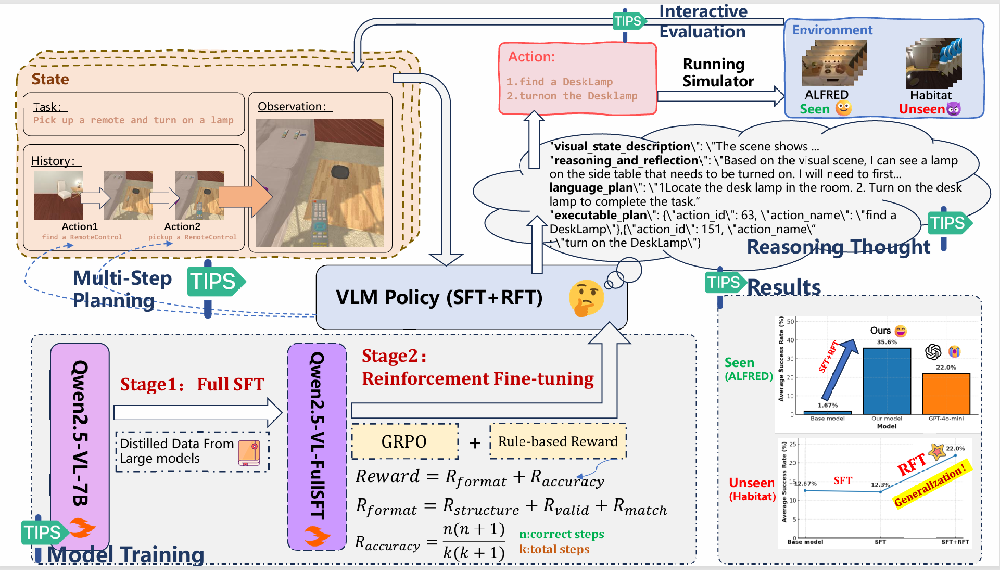

# 🤖🗺️ Reinforced Reasoning for Embodied Planning <!-- README Title -->

<!-- <p align="center">
  
</p> -->

<!-- Badges -->
<p align="center">
  <a href="https://arxiv.org/abs/2505.22050">
    
  </a>
  <a href="https://huggingface.co/your-org/rr-ep">
    
  </a>
  <a href="https://your-project-site.org">
    
  </a>
</p>

> **Reinforced Reasoning for Embodied Planning**  
> Under Review, Anonymous Authors

<!-- > [Di Wu](https://wudi7012.github.io/), Jiaxin Fan*, Junzhe Zang*, Guanbo Wang, Wei Yin, Wenhao Li†, Bo Jin†

>Tongji MAIL-TAII Lab, Tongji University, Tsinghua University, Bank of Communications -->


<p align="center">
  
</p>

<!-- ---

## 🔗 Jump to
| Section | Description |
|---------|-------------|
| [Overview](#-overview) | What is *Reinforced Reasoning for Embodied Planning*? |
| [Model](#-model) | Architecture & weights |
| [Usage](#️-usage) | Quick-start & inference |
| [Performance](#-performance) | Numbers on Embench |
| [Changelog](#-changelog) | Release history |
| [Acknowledgement](#-acknowledgement) | Credits |
| [Citation](#-citation) | How to cite |

--- -->
---

## 🧐 Overview

**Multi-step embodied planning** tasks challenge agents to translate first-person visual observations and natural-language goals into coherent, sequential actions that dynamically affect their environment. Unlike static tasks like visual QA or math, these tasks require continuous spatial reasoning, temporal consistency, and adaptation across multiple decision turns.

However, current vision-language models (VLMs), even those with strong static capabilities, often fail in such settings—producing redundant, incoherent, or short-sighted action sequences.

To address this gap, we propose:

> 🔁 **Reinforced Reasoning for Embodied Planning**
> A two-stage fine-tuning pipeline that equips VLMs with **multi-step reasoning** and **long-horizon planning** abilities in dynamic environments.

### 🔧 Our Pipeline

1. **Supervised Fine-tuning (SFT):**
   We distill \~4k high-quality multi-step trajectories from a powerful teacher model into Qwen2.5-VL-7B to initialize commonsense and structured reasoning.

2. **Reinforcement Fine-tuning (RFT):**
   Using a **rule-based reward** tailored for multi-step decision quality, we apply **GRPO** to align model outputs with long-horizon planning objectives.

### 🧪 Results

We evaluate on the **Embench** benchmark (EB-ALFRED & EB-Habitat) and find that our 7B model:

* Outperforms 70B+ open-source baselines,
* **Surpasses GPT-4o-mini** in planning efficiency and coherence,
* Generalizes well to unseen embodied environments.


## 🗒️ News

* **2025-05-28** : 🚀 We released our initial [arXiv paper](https://arxiv.org/abs/2505.22050) on **Reinforced Reasoning for Embodied Planning**.
* **2025-06-06** : 🧠 Github Page Released
<!-- * **2025-06-06** : 📦 We released our [training datasets](https://huggingface.co/your-org/rr-ep-sft-data) for both SFT and RFT stages.
* **2025-06-07** : 🛠️ We open-sourced all [code and scripts](https://github.com/your-org/rr-ep) for fine-tuning, evaluation, and inference. -->

---


## 🏗️ Model and Dataset

We release all key components of our two-stage training pipeline, including datasets and models for both **Supervised Fine-tuning (SFT)** and **Reinforcement Fine-tuning (RFT)**.

| Component          | Description                                             | Download                                                           |
| ------------------ | ------------------------------------------------------- | ------------------------------------------------------------------ |
| 🧩 **SFT Dataset** | \~4.2k Gemini-2.0 distilled multi-step plans            | [🤗 Hugging Face](https://huggingface.co/your-org/rr-ep-sft-data)  |
| 🧩 **RFT Dataset** | \~43.9k ALFRED-derived episodes with reward annotations | [🤗 Hugging Face](https://huggingface.co/your-org/rr-ep-rft-data)  |
| 🧠 **SFT Model**   | Qwen2.5-VL-7B fine-tuned with SFT only                  | [🤗 Hugging Face](https://huggingface.co/your-org/rr-ep-sft-model) |
| 🧠 **RFT Model**   | Qwen2.5-VL-7B further optimized via GRPO                | [🤗 Hugging Face](https://huggingface.co/your-org/rr-ep-rft-model) |


---
## ⚡️ Usage

<details open>
<summary><strong>STAGE 1. 🧠 Supervised Fine-tuning (SFT)</strong></summary>

**Step 1. Environment Setup**
```bash
# ...
```

**Step 2. Download Dataset**

```bash
# ...
```

**Step 3. Launch Training**

```bash
# ...
```

**Step 4. Save & Check Model**

```bash
# ...
```

</details>

<details>
<summary><strong>STAGE 2. 🎯 Reinforcement Fine-tuning (RFT)</strong></summary>

**Step 1. Prepare Reward Script**

```bash
# ...
```

**Step 2. Load SFT Model**

```bash
# ...
```

**Step 3. Launch GRPO Training**

```bash
# ...
```

**Step 4. Save & Check Model**

```bash
# ...
```

</details>

<details>
<summary><strong>📊 Evaluation on Embench</strong></summary>

**Step 1. Prepare Config**

```bash
# ...
```

**Step 2. Run Evaluation Script**

```bash
# ...
```

**Step 3. View Results**

```bash
# ...
```

</details>


---

## 📈 Performance

### In-domin Result
<p align="center">
  
</p>

### Out-of-domin Result
<p align="center">
  
</p>

---

## 🙏 Acknowledgement

This project builds upon the excellent work of:

* **[LLaMA-Factory](https://github.com/hiyouga/LLaMA-Factory)** for SFT
* **[MM-Eureka](https://github.com/ModalMinds/MM-EUREKA)** for reinforcement fine-tuning
* **[Embench](https://github.com/EmbodiedBench/EmbodiedBench)** simulators

---

## ✏️ Citation

If you find this repo useful, please cite:

```bibtex
@article{wu2025reinforced,
  title={Reinforced Reasoning for Embodied Planning},
  author={Wu, Di and Fan, Jiaxin and Zang, Junzhe and Wang, Guanbo and Yin, Wei and Li, Wenhao and Jin, Bo},
  journal={arXiv preprint arXiv:2505.22050},
  year={2025}
}
```

---

<p align="center"><i>Enjoy reasoning in embodied worlds 🤖🗺️!</i></p>
```
